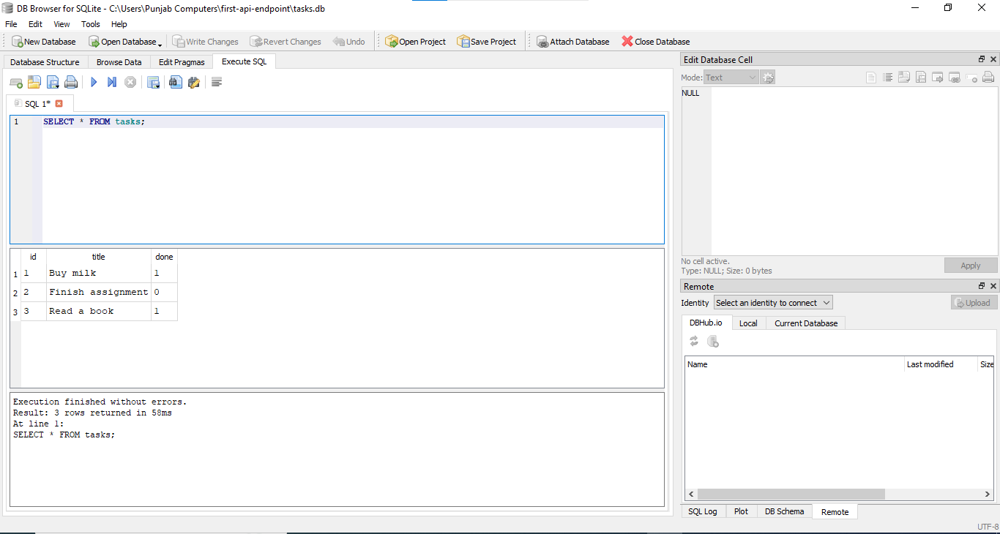

# 🚀 First API Endpoint

[](https://www.python.org/)
[](https://flask.palletsprojects.com/)
[](#)

A minimal, production-style Flask backend built for the **FlyRank Backend AI Engineering** internship track — designed to demonstrate the core request → response loop with clean, testable JSON endpoints.

---

## 📌 Overview

This project stands on the *server side* of the request-response cycle: a lightweight Flask app exposing two JSON endpoints, verified through both browser and command-line (`curl`) testing.

## ⚙️ Endpoints

| Method | Route      | Description                          |
|--------|-----------|---------------------------------------|
| `GET`  | `/`        | Returns a welcome message             |
| `GET`  | `/status`  | Returns developer and status info     |

## 🛠️ Tech Stack

- **Language:** Python 3.13
- **Framework:** Flask 3.1
- **Testing:** Browser + `curl`

## 🚦 Getting Started

### Prerequisites
- Python 3.10+ installed
- `pip` package manager

### Installation

```bash
git clone https://github.com/Numair-Iqbal/first-api-endpoint.git
cd first-api-endpoint
pip install -r requirements.txt
```

### Run the Server

```bash
python app.py
```

The server will start at `http://127.0.0.1:5000`.

### Test It

**Browser:**
```
http://127.0.0.1:5000/
http://127.0.0.1:5000/status
```

**Curl:**
```bash
curl http://127.0.0.1:5000/
curl http://127.0.0.1:5000/status
```

## 📂 Project Structure

```
first-api-endpoint/
├── app.py             # Flask application with two JSON routes
├── requirements.txt    # Project dependencies
└── README.md            # Project documentation
```

## 🧪 Testing

Both endpoints were verified through two independent methods to confirm correct JSON responses.

### Browser

| `/` | `/status` |
|---|---|
|  |  |

### Curl

| Request 1 | Request 2 |
|---|---|
|  |  |

---

## 🗄️ Database Integration (SQLite)

This project has evolved from a simple two-endpoint API into a complete, database-backed CRUD API. The in-memory storage limitation has been resolved — all data now persists using **SQLite**.

### Why SQLite?

SQLite was chosen for this project because:
- It requires **no separate database server** — the entire database lives in a single file
- It needs **zero installation or configuration**
- It's ideal for small to medium projects and local development
- Data now **survives server restarts**, which was not possible with the previous in-memory version

### Where the database lives

The database file `tasks.db` is created **automatically** the first time the application runs. It is excluded from version control via `.gitignore`, so every fresh clone of this repository starts with a clean database and reseeds the example data automatically.

### Task Endpoints (SQLite-backed)

| Method | Route | Description |
|--------|-------|-------------|
| GET | `/tasks` | Returns all tasks |
| GET | `/tasks/<id>` | Returns a single task by ID |
| POST | `/tasks` | Creates a new task |
| PUT | `/tasks/<id>` | Updates an existing task |
| DELETE | `/tasks/<id>` | Deletes a task |

All endpoints use **parameterized queries** (`?` placeholders) to prevent SQL injection, and return proper status codes:
- `200 OK` — successful GET/PUT
- `201 Created` — successful POST
- `204 No Content` — successful DELETE
- `400 Bad Request` — invalid/missing input
- `404 Not Found` — task ID doesn't exist

### How to run this project

```bash
git clone https://github.com/Numair-Iqbal/first-api-endpoint.git
cd first-api-endpoint
pip install -r requirements.txt
python app.py
```

The server starts at `http://127.0.0.1:5000`. The database and its table are created automatically, and three example tasks are seeded on first run only.

### Testing persistence

1. Run the server and visit `http://127.0.0.1:5000/tasks`
2. Stop the server (`Ctrl+C`) and restart it (`python app.py`)
3. Visit `/tasks` again — the same three tasks are still there, proving the data survived the restart

### Exploring the database manually

The database was opened directly in **DB Browser for SQLite** to run queries by hand and verify that the API and the database file are always in sync.

Example query executed:

```sql
SELECT COUNT(*) FROM tasks;
```

**Result:** `3` — confirming the seed data was inserted correctly and only runs once, even across multiple restarts.

A second query was also run directly in DB Browser:

```sql
UPDATE tasks SET done = 1 WHERE id = 1;
```

After clicking **"Write Changes"**, refreshing `http://127.0.0.1:5000/tasks` in the browser immediately showed the updated value — proving that the API and DB Browser both read from the exact same source of truth, with no syncing required.

**Screenshot — Database opened in DB Browser for SQLite:**



---

## 👨‍💻 Author

**Numair Iqbal**
Backend AI Engineering Intern @ FlyRank
BS Computer Science, University of Layyah

---

<p align="center">Built as part of the <b>FlyRank AI Internship</b> — Backend AI Engineering Track</p>
