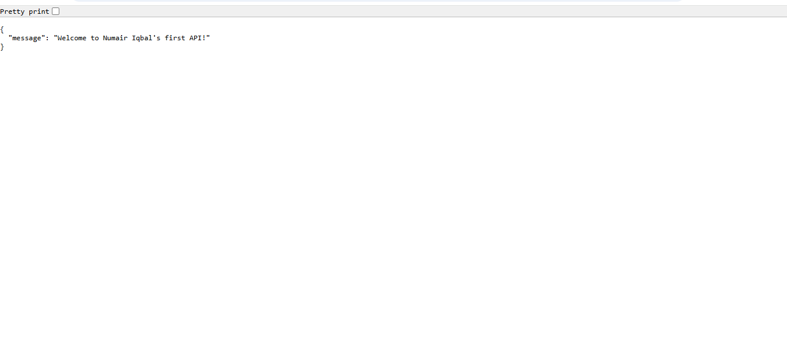
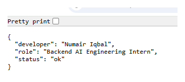
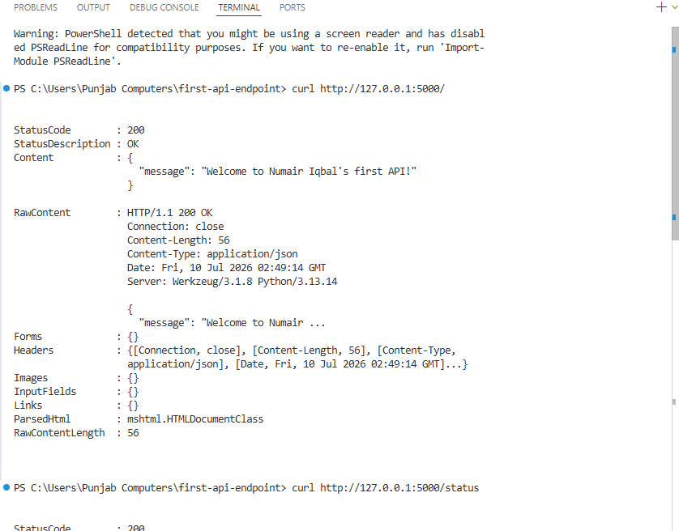
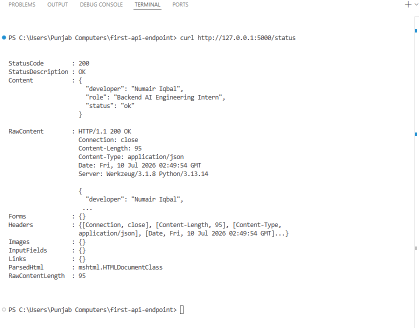

# 🚀 First API Endpoint

[](https://www.python.org/)
[](https://flask.palletsprojects.com/)
[](#)

A minimal, production-style Flask backend built for the **FlyRank Backend AI Engineering** internship track — designed to demonstrate the core request → response loop with clean, testable JSON endpoints.

---

## 📌 Overview

This project stands on the *server side* of the request-response cycle: a lightweight Flask app exposing two JSON endpoints, verified through both browser and command-line (`curl`) testing.

## ⚙️ Endpoints

| Method | Route      | Description                          |
|--------|-----------|---------------------------------------|
| `GET`  | `/`        | Returns a welcome message             |
| `GET`  | `/status`  | Returns developer and status info     |

## 🛠️ Tech Stack

- **Language:** Python 3.13
- **Framework:** Flask 3.1
- **Testing:** Browser + `curl`

## 🚦 Getting Started

### Prerequisites
- Python 3.10+ installed
- `pip` package manager

### Installation

```bash
git clone https://github.com/Numair-Iqbal/first-api-endpoint.git
cd first-api-endpoint
pip install -r requirements.txt
```

### Run the Server

```bash
python app.py
```

The server will start at `http://127.0.0.1:5000`.

### Test It

**Browser:**
```
http://127.0.0.1:5000/
http://127.0.0.1:5000/status
```

**Curl:**
```bash
curl http://127.0.0.1:5000/
curl http://127.0.0.1:5000/status
```

## 📂 Project Structure

```
first-api-endpoint/
├── app.py             # Flask application with two JSON routes
├── requirements.txt    # Project dependencies
└── README.md            # Project documentation
```

## 🧪 Testing

Both endpoints were verified through two independent methods to confirm correct JSON responses.

### Browser

| `/` | `/status` |
|---|---|
|  |  |

### Curl

| Request 1 | Request 2 |
|---|---|
|  |  |

## 👨‍💻 Author

**Numair Iqbal**
Backend AI Engineering Intern @ FlyRank
BS Computer Science, University of Layyah

---

<p align="center">Built as part of the <b>FlyRank AI Internship</b> — Backend AI Engineering Track</p>
